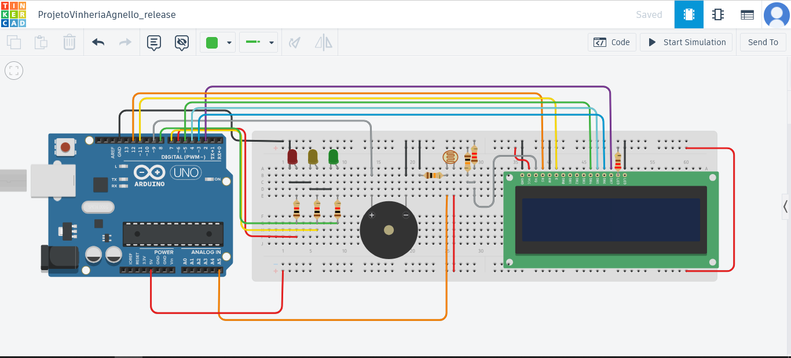

# Caso da Vinheria Agnello - Data Logger - Checkpoint 1 - 1ESPA - Primeiro Semestre de 2024

## Mestre: 
- Professor Fábio Cabrini
## Membros do Grupo - **Moskitto**:
- [**Gabriel Kato**](https://github.com/kato8088) - RM560000
- [**Francisco Vargas**](https://github.com/Franciscov25) - RM560322
- [**Gabriel Couto**](https://github.com/rouri404) - RM559579
- [**João Vitor**](https://github.com/joaomatosq) - RM559246

## Descrição do Projeto:
Essa é a primeira parte do projeto de Data Logger do primeiro semestre de Edge Computing. O sistema até o momento consiste em um fotoresistor, três LEDs, um Buzzer, uma tela LCD 16x2 e um microcontrolador Atmel ATMega 328P sob uma placa Arduino Nano.

## Componentes Utilizados:
- **Arduino Uno R3** ou **Arduino Nano**
- **Tela LCD 16x2**
- **Sensor LDR**
- **LEDs**: Vermelho, Amarelo e Verde
- **Buzzer**
- **Resistores**: 220Ω, 1kΩ, 1.2kΩ e 10kΩ
- **Jumpers**
- **Protoboard**

## Pinagem:
- **LED Vermelho:** Digital 2 (D2)
- **LED Amarelo:** Digital 3 (D3)
- **LED Verde:** Digital 4 (D4)
- **Buzzer:** Digital 5 (D5)
- **LDR:** Analógico 5 (A5)
- **Pinos usados pelo LCD:** DB7 (D2), DB6 (D3), DB5 (D4), DB4 (D5), E (D11), RS (D12)

## Funcionamento:
O código inicia com uma animação de *boot* do nosso grupo e então inicia o funcionamento do código principal. A função *luxTick()* verifica a medição da entrada analógica *A5* e dependendo da voltagem lida pelo Arduino, define a situação do ambiente da Vinheria como:
1. **Normal** (Nível 0 a 20): O ambiente está adequadamente iluminado, portanto somente o LED Verde é aceso.
2. **Atenção** (Nível 21 a 50): O ambiente está em um nível de iluminação inadequado, entre o normal e o crítico, portanto, o LED Amarelo é ligado e o buzzer apita brevemente 4 vezes.
3. **Alerta** (Nível 51 a 100): O ambiente está em uma condição inadequada para o armazenamento de vinhos, comprometendo sua qualidade, portanto, o LED Vermelho se acende e o buzzer apita repetidamente por 9 vezes (3 segundos no total).

As rotina principal (*void loop*) foi programada para rodar após a rotina de medição (*luxTick*) e um *delay* de 400ms.

A situação do ambiente e o nível da intensidade da luz são enviadas pela porta Serial do Arduino em uma Baud Rate de 9.6kbps.

## Montagem
Faça a montagem seguindo o esquema eletrônico disponibilizado em PDF ou pela imagem abaixo:

## Como instalar e rodar o projeto?
1. Conecte os fios e componentes conforme o esquema elétrico providenciado com a placa desconectada.
2. Conecte a placa ao PC.
3. Usando uma IDE compatível com a linguagem C++ e as bibliotecas do Arduino (como o Arduino IDE), cole o código-fonte do projeto no IDE, compile e faça o *upload* para a placa.
4. A instalação está completa! Caso queira monitorar os valores, use um monitor Serial como o PuTTY ou o monitor embutido no Arduino IDE, não se esqueça de configurar a Baud Rate corretamente (9600 baud).